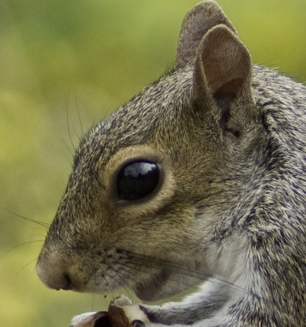
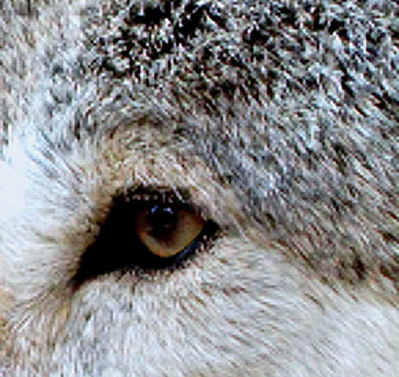
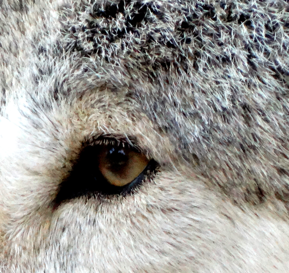
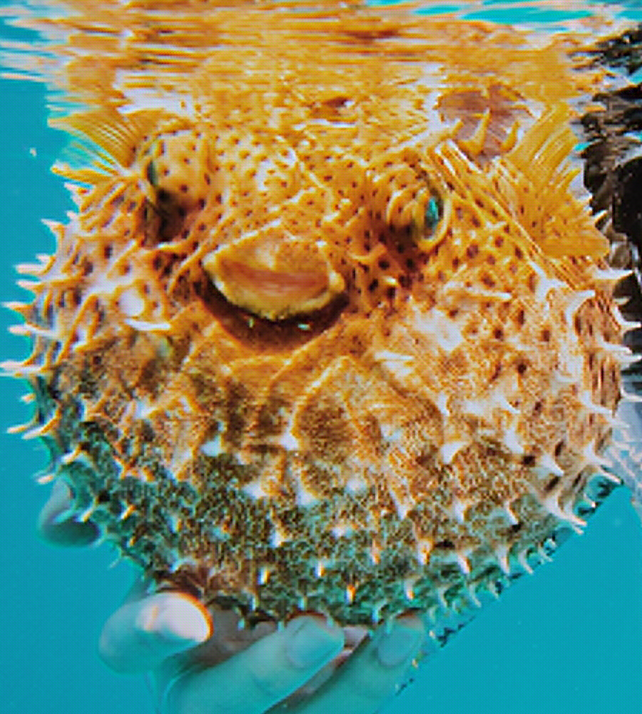
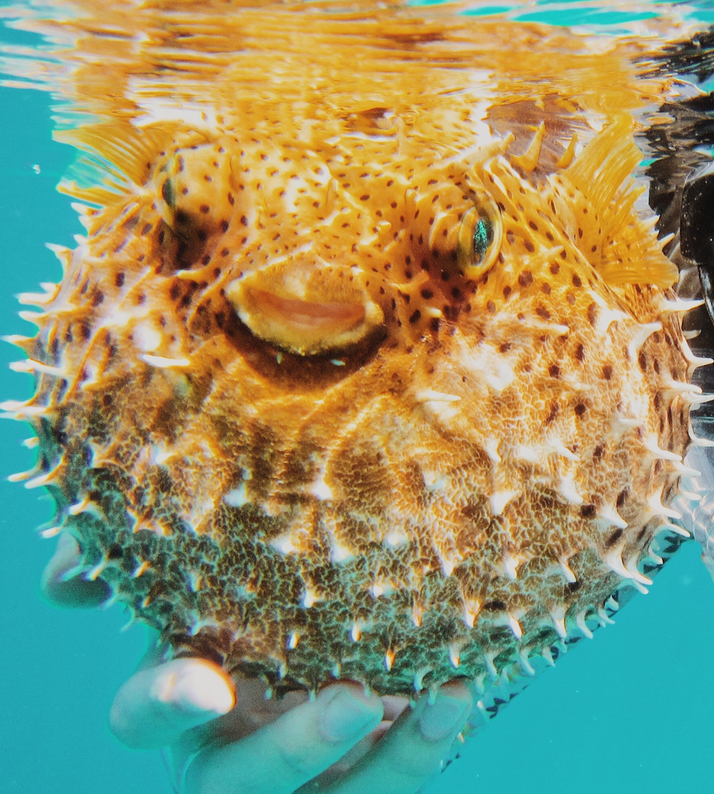

# ESRGAN: Enhanced Super-Resolution Generative Adversarial Networks
Pipeine for Image Super-Resolution task that based on a frequently cited paper, [ESRGAN: Enhanced Super-Resolution Generative Adversarial Networks](https://arxiv.org/abs/1809.00219) (Wang Xintao et al.), published in 2018.

In few words, image super-resolution (SR) techniques reconstruct a higher-resolution (HR) image or sequence
from the observed lower-resolution (LR) images, e.g. upscaling of 720p image into 1080p.

One of the common approaches to solving this task is to use deep convolutional neural networks
capable of recovering HR images from LR ones. And ESRGAN (Enhanced SRGAN) is one of them.
Key points of ESRGAN:

- SRResNet-based architecture with residual-in-residual blocks;
- Mixture of context, perceptual, and adversarial losses. Context and perceptual losses are used for proper image upscaling,
  while adversarial loss pushes neural network to the natural image manifold using a discriminator network
  that is trained to differentiate between the super-resolved images and original photo-realistic images.


### Technologies

* `Catalyst` as pipeline runner for deep learning tasks. This new and rapidly developing [library](https://github.com/catalyst-team/catalyst).
  can significantly reduce the amount of boilerplate code. If you are familiar with the TensorFlow ecosystem, you can think of Catalyst
  as Keras for PyTorch. This framework is integrated with logging systems such as the well-known [TensorBoard](https://www.tensorflow.org/tensorboard).
* `Pytorch`, `torchvision`, and `PIQ` as main frameworks for deep learning.
* `Albumentations` for data preprocessing.

## Quick Start

### Setup environment
```bash
pip install git+https://github.com/leverxgroup/esrgan.git
```

or install with `Poetry`

```bash
git clone https://github.com/leverxgroup/esrgan.git
cd esrgan
poetry install
```

### Run an experiment
```
# step 1 - supervised training of the model
catalyst-dl run -C esrgan/experiment/config_supervised.yml --benchmark

# step 2 - use weights from step 1 to train model using GAN approach
catalyst-dl run -C esrgan/experiment/config_gan.yml --benchmark
```
where `esrgan/experiment/config.yml` is a path to the [config](experiment/config.yml) file.

## Results
Some examples of work of ESRGAN model trained on [DIV2K](https://data.vision.ee.ethz.ch/cvl/DIV2K) dataset:

| LR</br>(low resolution) | ESRGAN</br>(ours) | HR</br>(high resolution) |
|:---:|:---:|:---:|
|  |  |  |
|  |  |  |
|  |  |  |

## License
`esrgan` is released under a CC BY-NC-ND 4.0 license. See [LICENSE](LICENSE) for additional details about it.
