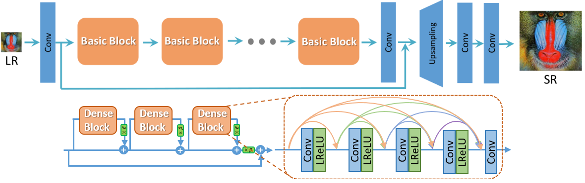

=================================================================
ESRGAN: Enhanced Super-Resolution Generative Adversarial Networks
=================================================================

.. raw:: html

    <a class="github-button" href="https://github.com/leverxgroup/esrgan" data-icon="octicon-star" data-size="large" data-show-count="true" aria-label="Star leverxgroup/esrgan on GitHub">Star</a> |
    <a class="github-button" href="https://github.com/leverxgroup/esrgan/fork" data-icon="octicon-repo-forked" data-size="large" data-show-count="true" aria-label="Fork leverxgroup/esrgan on GitHub">Fork</a> |
    <a class="github-button" href="https://github.com/leverxgroup/esrgan/issues" data-icon="octicon-issue-opened" data-size="large" data-show-count="true" aria-label="Issue leverxgroup/esrgan on GitHub">Issue</a>

----

Pipeine for Image Super-Resolution task that based on a frequently cited paper,
`ESRGAN: Enhanced Super-Resolution Generative Adversarial Networks <https://arxiv.org/abs/1809.00219>`__
(Wang Xintao et al.), published in 2018.

In few words, image super-resolution (SR) techniques reconstruct a higher-resolution (HR) image or sequence
from the observed lower-resolution (LR) images, e.g. upscaling of 720p image into 1080p.

One of the common approaches to solving this task is to use deep convolutional neural networks
capable of recovering HR images from LR ones. And ESRGAN (Enhanced SRGAN) is one of them.
Key points of ESRGAN:

- SRResNet-based architecture with residual-in-residual blocks;
- Mixture of context, perceptual, and adversarial losses. Context and perceptual losses are used for proper
  image upscaling, while adversarial loss pushes neural network to the natural image manifold using a discriminator
  network that is trained to differentiate between the super-resolved images and original photo-realistic images.

Technologies
============

* `Catalyst` as pipeline runner for deep learning tasks. This new and rapidly developing `library <https://github.com/catalyst-team/catalyst>`__
  can significantly reduce the amount of boilerplate code. If you are familiar with the TensorFlow ecosystem,
  you can think of Catalyst as Keras for PyTorch. This framework is integrated with logging systems
  such as the well-known `TensorBoard <https://www.tensorflow.org/tensorboard>`__.
* `Pytorch`, `torchvision`, and `PIQ` as main frameworks for deep learning.
* `Albumentations` for data preprocessing.

Quick Start
===========

Setup environment
-----------------

`esrgan` requires python >= 3.8.

::

   pip install git+https://github.com/leverxgroup/esrgan.git

or install with ``Poetry``

::

   git clone https://github.com/leverxgroup/esrgan.git
   cd esrgan
   poetry install

Run an experiment
-----------------

::

   # step 1 - download dir with ESRGAN experiment
   git clone --depth 1 https://github.com/leverxgroup/esrgan.git

   # step 2 - training of the model
   catalyst-dl run -C esrgan/config.yml --benchmark

where `esrgan/config.yml` is a path to the `config file <../config.yml>`__.

Results
=======

Some examples of work of ESRGAN model trained on `DIV2K <https://data.vision.ee.ethz.ch/cvl/DIV2K>`__ dataset:

.. table::
   :widths: 33 33 33

   +---------------------------------------+------------------------------------------+---------------------------------------+
   | .. centered:: LR (low resolution)     | .. centered:: ESRGAN (ours)              | .. centered:: HR (high resolution)    |
   +=======================================+==========================================+=======================================+
   | .. image:: ./_static/sq_crop_lr.png   | .. image:: ./_static/sq_crop_sr_x4.png   | .. image:: ./_static/sq_crop_hr.png   |
   |    :width: 128px                      |    :width: 128px                         |    :width: 128px                      |
   |    :height: 128px                     |    :height: 128px                        |    :height: 128px                     |
   |    :align: center                     |    :align: center                        |    :align: center                     |
   +---------------------------------------+------------------------------------------+---------------------------------------+
   | .. image:: ./_static/wf_crop_lr.png   | .. image:: ./_static/wf_crop_sr_x4.png   | .. image:: ./_static/wf_crop_hr.png   |
   |    :width: 128px                      |    :width: 128px                         |    :width: 128px                      |
   |    :height: 128px                     |    :height: 128px                        |    :height: 128px                     |
   |    :align: center                     |    :align: center                        |    :align: center                     |
   +---------------------------------------+------------------------------------------+---------------------------------------+
   | .. image:: ./_static/fish_crop_lr.png | .. image:: ./_static/fish_crop_sr_x4.png | .. image:: ./_static/fish_crop_hr.png |
   |    :width: 128px                      |    :width: 128px                         |    :width: 128px                      |
   |    :height: 128px                     |    :height: 128px                        |    :height: 128px                     |
   |    :align: center                     |    :align: center                        |    :align: center                     |
   +---------------------------------------+------------------------------------------+---------------------------------------+

GitHub
======

The project's GitHub repository can be found `here <https://github.com/leverxgroup/esrgan>`__.
Bugfixes and contributions are very much appreciated!

License
=======

`esrgan` is released under a CC-BY-NC-ND-4.0 license. See `LICENSE <../LICENSE>`__ for additional details about it.

.. toctree::
   :maxdepth: 2
   :caption: API

   pages/api/core
   pages/api/models
   pages/api/criterions
   pages/api/datasets
   pages/api/utils

Indices and tables
==================

:ref:`genindex`
