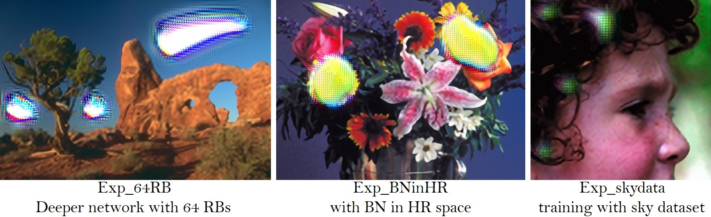

======
ESRGAN
======

Network Architecture
====================

.. image:: ../_static/architecture.png
   :width: 100%

Main modifications in the structure of generator G, discriminator D, and training process in comparison to SRGAN:

1. all BN layers were removed from the generator;
2. original basic blocks were replaced with the proposed Residual-in-Residual Dense Blocks (RRDB),
   which combines multi-level residual network and dense connections;
3. relativistic discriminator, which tries to predict the probability that a real image :math:`x_r`
   is relatively more realistic than a fake one :math:`x_f`;
4. perceptual loss on features before activation.

Qualitative Results
===================

    PSNR (evaluated on the Y channel) and the perceptual index used in the PIRM-SR challenge
    are also provided for reference. `\[1\]`_

.. image:: ../_static/qualitative_cmp_01.jpg
   :width: 100%
.. image:: ../_static/qualitative_cmp_02.jpg
   :width: 100%
.. image:: ../_static/qualitative_cmp_03.jpg
   :width: 100%
.. image:: ../_static/qualitative_cmp_04.jpg
   :width: 100%

Ablation Study
==============

    Overall visual comparisons for showing the effects of each component in ESRGAN.
    Each column represents a model with its configurations in the top.
    The red sign indicates the main improvement compared with the previous model. `\[1\]`_

.. image:: ../_static/abalation_study.png
   :width: 100%

BatchNorm artifacts
===================

    We empirically observe that BN layers tend to bring artifacts. These artifacts, namely BN artifacts,
    occasionally appear among iterations and different settings, violating the needs for a stable performance
    over training. We find that the network depth, BN position, training dataset and training loss
    have impact on the occurrence of BN artifacts. `\[1\]`_

Useful techniques to train a very deep network
==============================================

    We find that residual scaling and smaller initialization can help to train a very deep network.

    - A smaller initialization than MSRA initialization (multiplying 0.1 for all initialization parameters
      that calculated by MSRA initialization) works well in our experiments;
    - In our settings, for each residual block, the residual features after the last convolution layer
      are multiplied by 0.2. `\[1\]`_

.. |init a| image:: ../_static/train_deeper_neta.png
   :width: 49%
.. |init b| image:: ../_static/train_deeper_netb.png
   :width: 49%

|init a| |init b|

The influence of training patch size
====================================

    We observe that training a deeper network benefits from a larger patch size.
    Moreover, the deeper model achieves more improvement (∼0.12dB) than the shallower one (∼0.04dB)
    since larger model capacity is capable of taking full advantage of larger training patch size.
    (Evaluated on Set5 dataset with RGB channels.) `\[1\]`_

.. |16 blocks| image:: ../_static/patch_a.png
   :width: 49%
.. |23 blocks| image:: ../_static/patch_b.png
   :width: 49%

|16 blocks| |23 blocks|

.. _\[1\]: https://github.com/xinntao/ESRGAN
